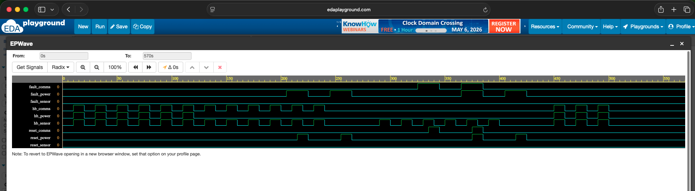
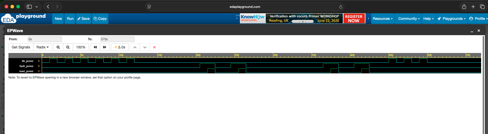
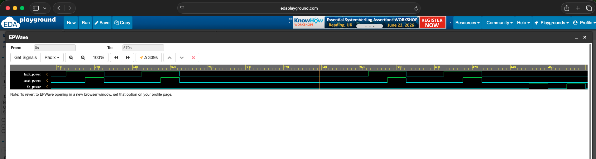
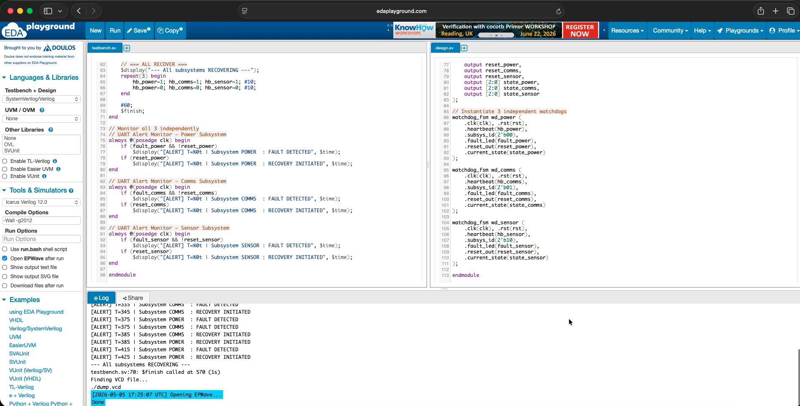
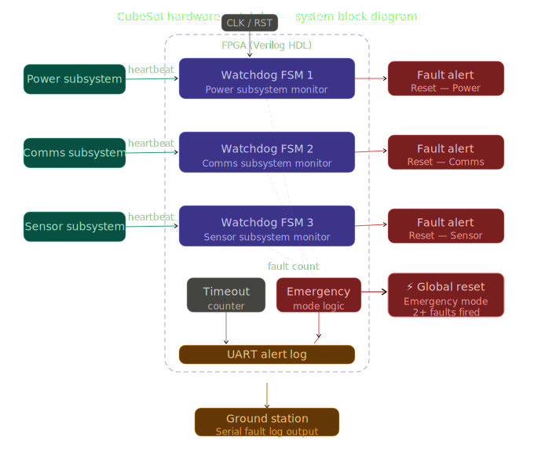
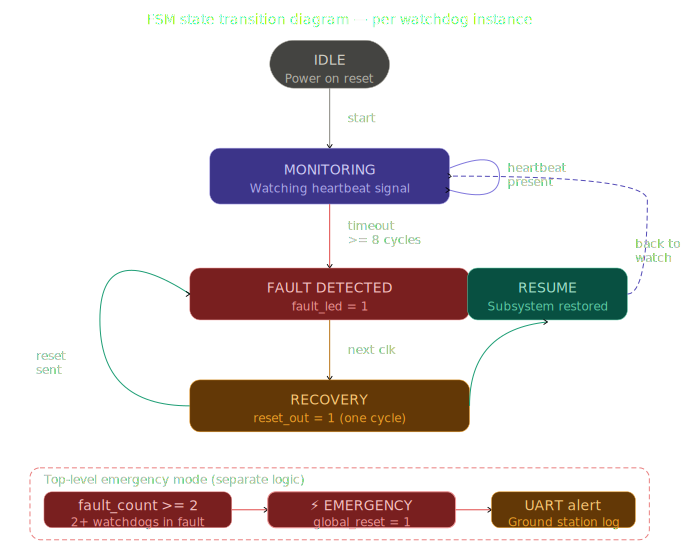
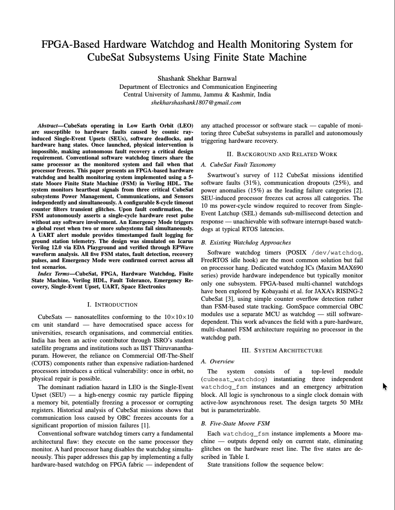

# FPGA-Based Hardware Watchdog & Health Monitoring System for CubeSat Subsystems

> **Final Year B.Tech** — Electronics & Communication Engineering  
> Central University of Jammu | May 2026  
> **Author:** Shashank Shekhar Barnwal

---

## Overview

CubeSats operate in Low Earth Orbit with **no possibility of physical intervention** once launched. A single subsystem freeze — whether caused by cosmic ray-induced bit flips, software deadlocks, or hardware anomalies — can permanently disable a satellite worth crores.

This project presents a **hardware-only watchdog system** implemented on FPGA using Finite State Machine (FSM) architecture in Verilog HDL. It independently monitors **three critical CubeSat subsystems** — Power, Communications, and Sensors — in parallel, and autonomously triggers hardware recovery without any software involvement.

>  *Inspired by real-world CubeSat systems observed during a research internship at the Indian Institute of Space Science and Technology (IIST), Thiruvananthapuram — under the Department of Space, Government of India.*

---

## Why Hardware Watchdog over Software?

| Feature | Software Watchdog | This Project (Hardware FSM) |
|---|---|---|
| Runs on | Same processor it monitors | Independent FPGA fabric |
| If processor hangs | Watchdog hangs too  | Keeps running  |
| Response time | Software interrupt latency | Single clock cycle  |
| Subsystems monitored | Usually 1 | 3 independently  |
| Cost | Free (software) | (simulation)  |
| Radiation tolerance | None | FPGA-inherent |

---

##  System Architecture

```
┌─────────────────────────────────────────────────┐
│              FPGA (Verilog HDL)                  │
│                                                 │
│  [Power Subsystem] ──hb──► [Watchdog FSM 1] ──► fault_power / reset_power  │
│  [Comms Subsystem] ──hb──► [Watchdog FSM 2] ──► fault_comms / reset_comms  │
│  [Sensor Subsystem]──hb──► [Watchdog FSM 3] ──► fault_sensor/ reset_sensor │
│                                                 │
│              [Timeout Counter]                  │
│              [UART Alert Log]                   │
└─────────────────────────────────────────────────┘
```

---

##  FSM State Transitions

Each watchdog instance operates through **5 states**:

```
        Power ON
            │
         [IDLE]
            │ start
     [MONITORING] ◄──────────────────────┐
            │ timeout_counter >= 8        │
    [FAULT DETECTED]                      │
            │ next clk                    │
        [RECOVERY] ── reset_out=1         │
            │ reset sent                  │
         [RESUME] ───────────────────────┘
```

**State descriptions:**

| State | Code | Behaviour |
|---|---|---|
| `IDLE` | `3'b000` | Initial state after power-on or reset |
| `MONITORING` | `3'b001` | Actively watching heartbeat signal |
| `FAULT_DETECTED` | `3'b010` | Heartbeat absent for ≥8 cycles — fault confirmed |
| `RECOVERY` | `3'b011` | Asserts `reset_out` for exactly 1 clock cycle |
| `RESUME` | `3'b100` | Recovery complete — returns to monitoring |

---

##  Repository Structure

```
cubesat-watchdog-fpga/
├── src/
│   ├── design.sv          # Watchdog FSM + 3-subsystem top module
│   └── testbench.sv       # Simulation testbench with UART alert monitor
├── simulation/
│   ├── waveform_full.png          # Full 9-signal waveform
│   ├── waveform_fault_detect.png  # Fault detection zoom
│   ├── waveform_recovery.png      # Recovery pulse zoom
│   └── uart_log.png               # UART alert output
├── docs/
│   ├── block_diagram.png          # System block diagram
│   └── fsm_state_diagram.png      # FSM state transition diagram
└── README.md
```

---

##  Simulation Results

### Full System Waveform — 3 Subsystems Monitored Simultaneously

> `hb_power`, `hb_comms`, `hb_sensor` — heartbeat inputs  
> `fault_power`, `fault_comms`, `fault_sensor` — fault detection outputs  
> `reset_power`, `reset_comms`, `reset_sensor` — recovery pulse outputs





##  Block Diagram

##  FSM State Diagram


---

### UART Alert Log Output

```
--- All subsystems ONLINE ---
--- POWER subsystem FROZEN ---
[ALERT] T=215 | Subsystem POWER  : FAULT DETECTED
[ALERT] T=225 | Subsystem POWER  : RECOVERY INITIATED
--- COMMS subsystem FROZEN ---
[ALERT] T=335 | Subsystem COMMS  : FAULT DETECTED
[ALERT] T=345 | Subsystem COMMS  : RECOVERY INITIATED
[ALERT] T=375 | Subsystem POWER  : FAULT DETECTED
[ALERT] T=375 | Subsystem COMMS  : FAULT DETECTED
[EMERGENCY] T=385 | 2+ SUBSYSTEMS FAILED | GLOBAL RESET FIRED
[ALERT] T=385 | Subsystem COMMS  : RECOVERY INITIATED
[ALERT] T=385 | Subsystem POWER  : RECOVERY INITIATED
--- All subsystems RECOVERING ---
$finish called at 570 (1s)
```

---

## Run It Yourself

**Option 1 - EDA Playground (no install needed):**  
🔗 [Open in EDA Playground](https://edaplayground.com/x/n4rg)  
Select **Icarus Verilog 12.0**, tick **"Open EPWave after run"**, click **Run**.

**Option 2 - Local (Icarus Verilog):**
```bash
git clone https://github.com/shashankshekhar-001/cubesat-watchdog-fpga
cd cubesat-watchdog-fpga/src
iverilog -Wall -g2012 design.sv testbench.sv && vvp a.out
```

---

## 🔧 Key Design Decisions

**Timeout counter over direct heartbeat check?**  
A single missing heartbeat pulse could be a transient glitch. The 8-cycle timeout ensures only a sustained absence triggers a fault, eliminating false alarms. This mirrors how industrial-grade watchdog timers operate.

**Separate FSM per subsystem?**  
A shared FSM would serialize fault detection one fault would block monitoring of others. Three independent instances allow fully parallel, isolated fault handling, which is critical in real satellite operation where multiple simultaneous anomalies are possible.

**Hardware over software?**  
FPGA fabric operates independently of any attached processor. If the monitored system is completely frozen, the watchdog is unaffected and continues operating something a software watchdog running on the same processor cannot guarantee.

**Emergency Mode**
When two or more subsystems fail simultaneously, individual recovery is insufficient. The system escalates to a global reset, which is the standard fault recovery strategy in radiation-hardened satellite OBC designs.

---

## Real-World Applications

- **ISRO Student Satellite Program** - OBC fault recovery
- **HAL Avionics Systems** - UAV embedded fault tolerance  
- **Automotive ADAS** - Safety-critical processor monitoring
- **Medical Devices** - Pacemakers, insulin pumps
- **Qualcomm Snapdragon** - Hardware watchdog timers in every modern SoC

---

##  Tools Used

| Tool | Purpose |
|---|---|
| Icarus Verilog 12.0 | HDL simulation |
| EDA Playground | Online simulation environment |
| EPWave | Waveform analysis |
| Verilog / SystemVerilog | Hardware description language |

---

##  Author

**Shashank Shekhar Barnwal**  
B.Tech ECE — Central University of Jammu (2022–2026)

-  Research Intern - DRDO SSPL Delhi (FPGA, PID, timing subsystems)
-  Intern - HAL MCSRDC Bangalore (FSM, UART, SPI, I2C on FPGA)
-  Research Intern - IIST Thiruvananthapuram (CubeSat systems, orbital mechanics)

[](https://github.com/shashankshekhar-001)

## Research Paper

**IEEE Format Technical Paper**  
*"FPGA-Based Hardware Watchdog and Health Monitoring System 
for CubeSat Subsystems Using Finite State Machine"*  
Shashank Shekhar Barnwal — Central University of Jammu, May 2026  

[](paper/CubeSat_FPGA_Watchdog_FSM.pdf)

[Read Full Paper](paper/CubeSat_FPGA_Watchdog_FSM.pdf)

---

## License

This project is open-source under the [MIT License](LICENSE).

---

*"If you lose connection with the satellite — you can't reach it again. This project exists because of that."*
